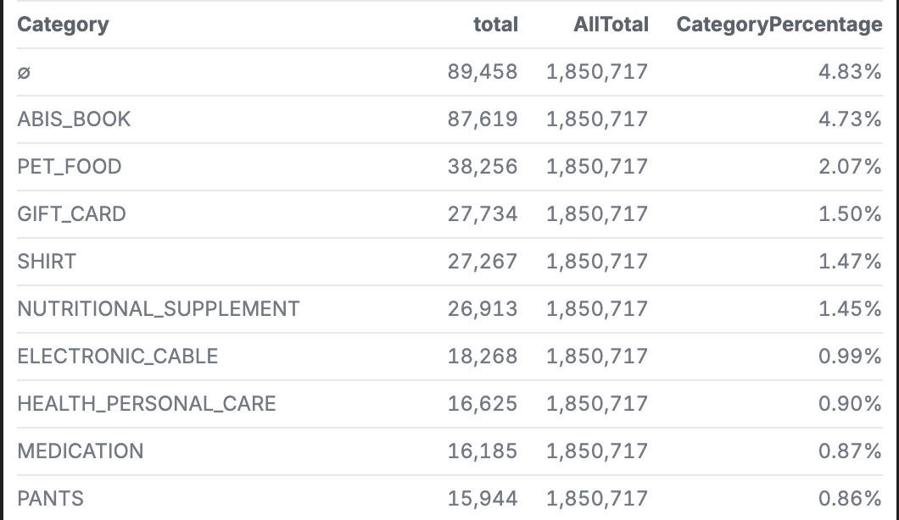
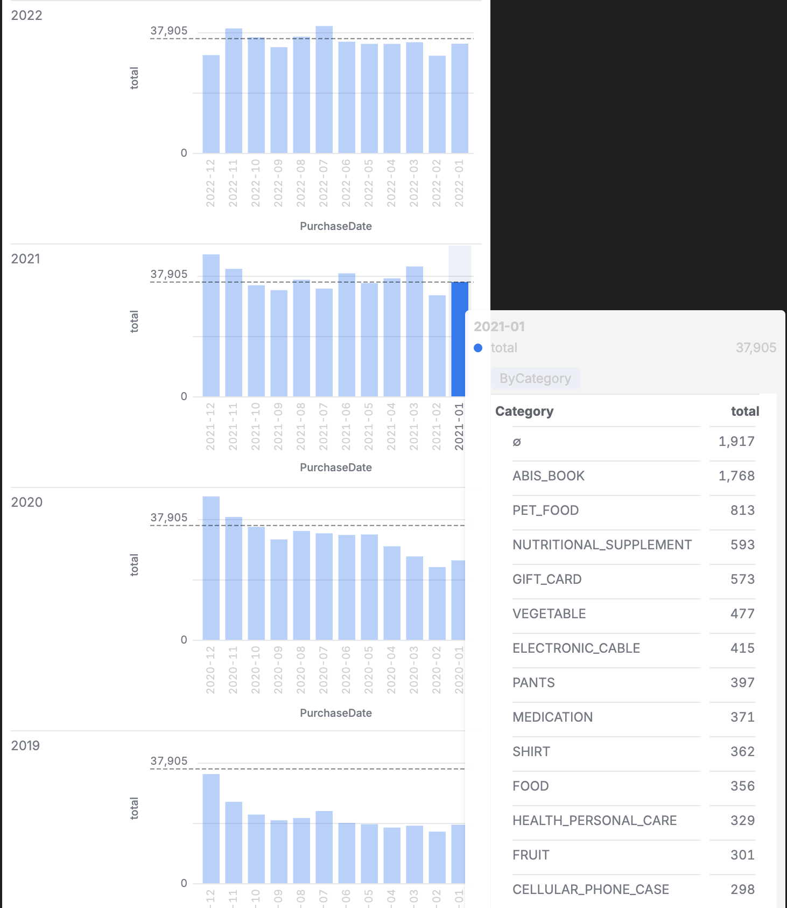
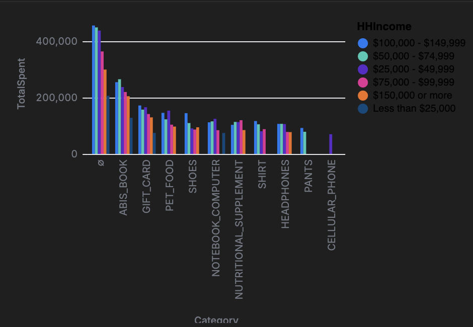
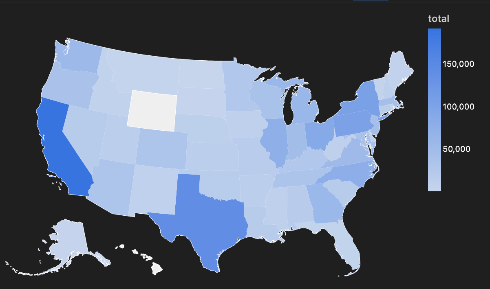
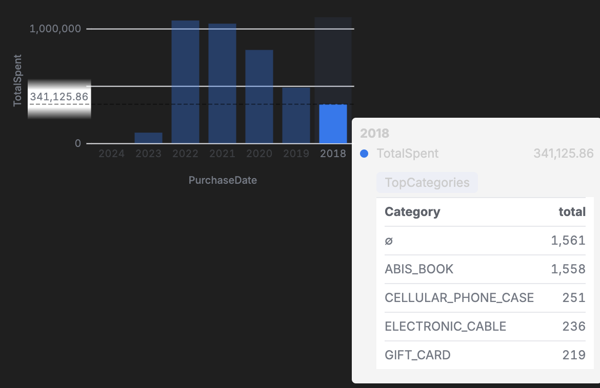

# Amazon Purchases and Consumer Survey Analysis
## Background 
This project analyzes a dataset related to Amazon purchase information and corresponding consumer survey responses. The data captures detailed insights into consumer behavior including product categories, purchase frequency, customer demographics, and account use. Understanding these patterns can help businesses enhance customer experience, optimize product offerings, and improve marketing strategies.
## Motivation
The motivation for this analysis is to uncover trends and insights into consumer purchasing behavior on Amazon. By understanding which product categories are most popular, what drives customer satisfaction, and how demographics influence purchasing decisions, businesses can refine their strategies to better serve their target audience. This analysis aims to provide actionable insights for e-commerce businesses, marketers, and consumer behavior researchers.
## Code 
This repository contains one malloy file and two CSV files:
    - AmazonInformation.malloynb: Performs the analysis of Amazon purchase data and survey responses.
    - amazon-purchases copy.csv: Includes information on items purchased such as product category, title, price, date, and quantity.
    - survey copy.csv: includes information from the consumer survey such as age group, education level, household income, number of people on the account, etc. 
## Findings 
Amazon dataset:
    - There are 1,871 categories 
    - The category with the most purcahses is ABIS_BOOK with 89,458 purchases
    - There are 824,722 unique items purchased
    - Amazon gift cards were the most purchased item
    - Item pricing panges from $6,398.95 to $0.01
    - The item purchased the most at once was photo prints 
Survey dataset: 
    - The age groups are broken down into 18-24, 25-34, 35-44, 45-54, 55-64, and 65 and older
    - 70.54% of users have their own Amazon account  
    - 77.3% of users are white / caucasian
    - 51.5% of users are female 
    - 64.43% of consumers use Amazon less than 5 times per month
Analysis 
    - No one category represents more than 5% of total purchases. The image below shows the number of purchases in each category.
     
    - 2021 was the year with the most purchases. These purchases are shown by month and category over time in the image below.
     
    - Spending differs by category based on the household income. This is shown in the image below.
     
    - The majority of purchases were in California and Texas
    
    - The amount spent by age group varies by year. Details on this information for age group 18-24 is shown in the image below
    
## Licensing 
The dataset analyzed in this project was sourced from publicly available consumer surveys and anonymized purchase records. Any additional files created as part of this analysis, including code and visualizations, are shared under the Apache License 2.0. This license applies to all files contained in this repository.
## Aknowledgements
This analysis was inspired by research into e-commerce consumer behavior and was conducted as part of an academic project at Gonzaga University. Special thanks to Professor Olsen for guidance in data analysis and interpretation. We also acknowledge the contributions of survey respondents and publicly available datasets that made this research possible.
    

